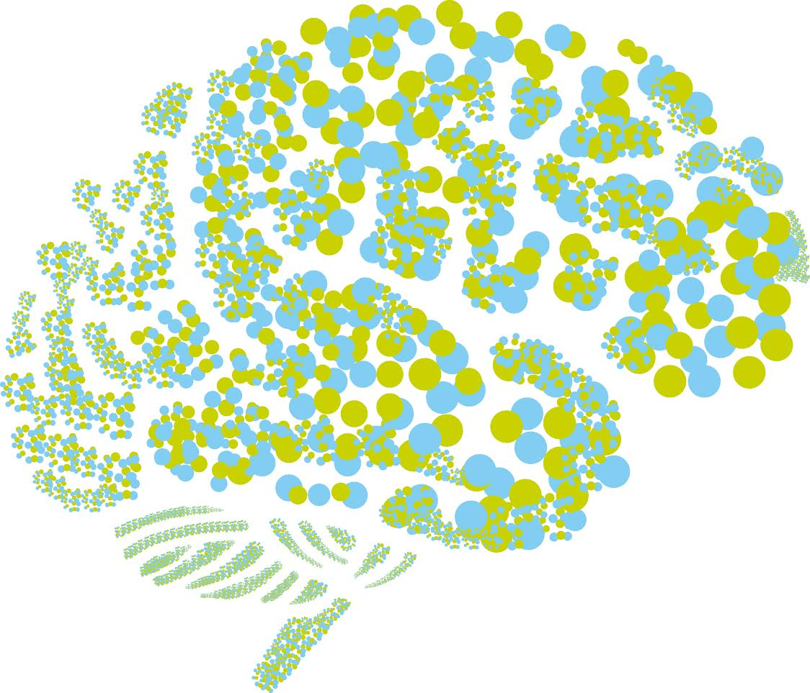

# Neuropointillist Tutorial

This is a tutorial for using neuropointillist to run some examples. This assumes that you have already followed the directions in [Installation](installation.md).

## Setting your PATH variable
After you have downloaded and installed the neuropointillist programs in a directory, you need to add this directory to your PATH variable. Suppose that you have downloaded the neuropointillist package into `~/neuropointillist`. Assuming you are running the bash shell, edit your PATH as follows:

`export PATH=$PATH:~/neuropointillist`

This code will make it so that when you type `npoint` or `npointrun` at the command line, your shell can find them. You can put this in your `~/.bashrc` file (if you use bash) so that you don’t have to do this every time you log in.

For detailed usage information, see the [Usage](usage.md). If you just want to get going, read on!

## [Simple fMRI example](fmri.example.md)
This is a quick start tutorial that uses simulated fMRI data in the directory `example.rawfmri`. This explains how to set up a model, debug it, and run it on raw fMRI data. This is primarily for educational purposes, because fMRI software is a lot faster and better at doing this).

## [Advanced fMRI example](fingerfootlips.example.md)
This tutorial uses a reproducibility data set downloaded from OpenNeuro to illustrate some of the more interesting things one might do in R that are difficult to achieve with fMRI software. 

## [Permutation testing fMRI example](fingerfootlips_permute.md)
This tutorial uses the data set and results from the advanced example, above, to demonstrate how you can use Neuropointillist to implement permutation testing approaches to cluster-based corrections for multiple comparisons (specifically, Equitable Thresholding and Clustering in AFNI).

## [Flournoy example (longitudinal)](flournoy.example.md)
This tutorial illustrates the kinds of analyses that form the primary motivation for `neuropointillist`: the ability to compare forms of change and run SEM growh models on single-subject data that has completed first level processing. 

## [Correcting for multiple comparisons](clustercorrection.md)
This tutorial provides some guidance for how to correct for multiple comparisons, primarily in the case where you are working with processed first level data.
